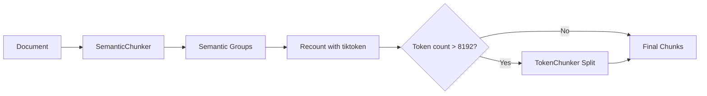

## Overview

Airweave automatically chunks documents before embedding to ensure:

- **Semantic coherence**: Chunks represent complete ideas
- **Token limits**: Chunks fit within embedding model limits (8192 tokens max)
- **Search quality**: Granular chunks return precise results

Two specialized chunkers handle different content types:

<CardGroup cols={2}>

<Card title="Semantic Chunker" icon="brain">
  For natural language content (docs, emails, support tickets)
  
  Uses embedding similarity to find topic boundaries
</Card>

<Card title="Code Chunker" icon="code">
  For source code files
  
  Uses AST parsing to chunk at function/class boundaries
</Card>

</CardGroup>

## Semantic Chunker

The `SemanticChunker` uses local embedding models to detect semantic boundaries without external API calls.

### How It Works

<Steps>
  <Step title="Sentence Splitting">
    Splits document into sentences using delimiters:
    ```python
    SENTENCE_DELIMITERS = [". ", "! ", "? ", "\n"]
    ```
  </Step>

  <Step title="Embedding Similarity">
    Computes embeddings for each sentence using a lightweight local model:
    ```python
    # Default: minishlab/potion-base-8M (8M params, ~0.5s/doc)
    EMBEDDING_MODEL = "minishlab/potion-base-8M"
    ```
    
    Compares similarity in a sliding window:
    ```python
    SIMILARITY_WINDOW = 10  # Compare 10 consecutive sentences
    ```
  </Step>

  <Step title="Boundary Detection">
    Identifies topic shifts when similarity drops below threshold:
    ```python
    SIMILARITY_THRESHOLD = 0.01  # Lower = larger chunks
    ```
    
    Creates semantic groups (chunks) of related sentences.
  </Step>

  <Step title="Token Recounting">
    Recounts tokens using OpenAI's tiktoken (`cl100k_base`) for accuracy:
    ```python
    chunk.token_count = len(
        tiktoken_tokenizer.encode(chunk.text, allowed_special="all")
    )
    ```
  </Step>

  <Step title="Safety Net">
    Splits any oversized chunks (>8192 tokens) at exact token boundaries:
    ```python
    if chunk.token_count > MAX_TOKENS_PER_CHUNK:  # 8192
        # Use TokenChunker to force-split
        split_chunks = token_chunker.chunk_batch([chunk.text])
    ```
  </Step>
</Steps>

### Configuration

All constants are defined in `platform/chunkers/semantic.py`:

<ParamField path="MAX_TOKENS_PER_CHUNK" type="int" default="8192">
  Hard limit matching OpenAI's `text-embedding-3-small` limit
  
  Enforced by TokenChunker safety net
</ParamField>

<ParamField path="SEMANTIC_CHUNK_SIZE" type="int" default="4096">
  Target size for semantic groups (soft limit)
  
  **Tradeoff**:
  - Larger = more context per chunk, fewer API calls
  - Smaller = more precise search results, more chunks
</ParamField>

<ParamField path="OVERLAP_TOKENS" type="int" default="128">
  Token overlap between consecutive chunks (reserved for future use)
</ParamField>

<ParamField path="EMBEDDING_MODEL" type="string" default="minishlab/potion-base-8M">
  Local embedding model for chunking decisions
  
  **Available options** (sorted by speed):
  
  **Model2Vec** (included with chonkie[semantic]):
  - `minishlab/potion-base-8M` - 8M params, ~0.5s/doc, good quality ⭐
  - `minishlab/potion-base-32M` - 32M params, ~1s/doc, better quality
  - `minishlab/potion-base-128M` - 128M params, ~2-3s/doc, best Model2Vec
  
  **SentenceTransformer** (requires: `poetry add sentence-transformers`):
  - `all-MiniLM-L6-v2` - 33M params, ~1-2s/doc, good quality
  - `all-MiniLM-L12-v2` - 66M params, ~2-3s/doc, better quality
  - `all-mpnet-base-v2` - 110M params, ~3-5s/doc, best quality
  
  <Note>
    This model is **only for chunking** (finding semantic boundaries). Final embeddings use your configured `DENSE_EMBEDDER` (OpenAI/Mistral/Local).
  </Note>
</ParamField>

<ParamField path="SIMILARITY_THRESHOLD" type="float" default="0.01">
  Threshold for detecting topic boundaries (0-1 range)
  
  **Tradeoff**:
  - **Lower** (0.001-0.01): Larger chunks, fewer splits, more context
  - **Higher** (0.05-0.1): Smaller chunks, more splits, precise boundaries
  
  **Default (0.01)** balances context and granularity.
</ParamField>

<ParamField path="SIMILARITY_WINDOW" type="int" default="10">
  Number of consecutive sentences to compare for similarity
  
  Larger window = smoother chunking, slower processing
</ParamField>

<ParamField path="MIN_SENTENCES_PER_CHUNK" type="int" default="1">
  Minimum sentences per chunk (prevents tiny fragments)
</ParamField>

<ParamField path="MIN_CHARACTERS_PER_SENTENCE" type="int" default="24">
  Minimum characters to count as a sentence
</ParamField>

### Advanced Features

<AccordionGroup>
  <Accordion title="Savitzky-Golay Filter" icon="wave-square">
    Smooths similarity scores to reduce noisy boundaries:
    
    ```python
    FILTER_WINDOW = 5         # Window length for filter
    FILTER_POLYORDER = 3      # Polynomial order
    FILTER_TOLERANCE = 0.2    # Boundary detection tolerance
    ```
    
    Reduces over-segmentation from minor similarity fluctuations.
  </Accordion>

  <Accordion title="Skip Window" icon="forward">
    Merges non-consecutive similar groups:
    
    ```python
    SKIP_WINDOW = 0  # 0=disabled, >0=merge similar groups
    ```
    
    Currently disabled (0). Enable to merge related sections separated by short transitions.
  </Accordion>

  <Accordion title="Delimiter Handling" icon="scissors">
    Configures how sentence delimiters are preserved:
    
    ```python
    SENTENCE_DELIMITERS = [". ", "! ", "? ", "\n"]
    INCLUDE_DELIMITER = "prev"  # Include with previous sentence
    ```
    
    Options: `"prev"`, `"next"`, `"none"`
  </Accordion>
</AccordionGroup>

### Two-Stage Pipeline

The semantic chunker uses a two-stage approach:



**Stage 1**: Semantic boundary detection (local embedding model)

**Stage 1.5**: Token recounting with tiktoken (OpenAI compatibility)

**Stage 2**: Safety net for oversized chunks (force-split at token boundaries)

<Info>
  The TokenChunker safety net **guarantees** all chunks are ≤8192 tokens, even if semantic chunking produces large groups.
</Info>

### Example Workflow

<CodeGroup>

```python Usage
from airweave.platform.chunkers.semantic import SemanticChunker

chunker = SemanticChunker()  # Singleton instance

# Batch processing
documents = [
    "Long document about machine learning...",
    "Technical guide to databases...",
    "Product requirements document..."
]

results = await chunker.chunk_batch(documents)

# results[0] = List of chunks for document 0
for chunk in results[0]:
    print(f"Chunk: {chunk['text'][:100]}...")
    print(f"Tokens: {chunk['token_count']}")
    print(f"Range: {chunk['start_index']}-{chunk['end_index']}")
    print()
```

```python Output Structure
[
    # Document 0 chunks
    [
        {
            "text": "Machine learning is a subset of AI...",
            "start_index": 0,
            "end_index": 523,
            "token_count": 128
        },
        {
            "text": "Neural networks are composed of layers...",
            "start_index": 524,
            "end_index": 1891,
            "token_count": 342
        }
    ],
    # Document 1 chunks
    [
        {...},
        {...}
    ]
]
```

```python Singleton Pattern
# Chunker is shared across all syncs in the pod
# Models load lazily on first use

class SemanticChunker(BaseChunker):
    _instance: Optional["SemanticChunker"] = None
    
    def __new__(cls):
        if cls._instance is None:
            cls._instance = super().__new__(cls)
            cls._instance._initialized = False
        return cls._instance
    
    def __init__(self):
        if self._initialized:
            return  # Already initialized
        
        self._semantic_chunker = None  # Lazy init
        self._token_chunker = None
        self._initialized = True
```

</CodeGroup>

## Code Chunker

The `CodeChunker` uses AST (Abstract Syntax Tree) parsing to chunk at logical code boundaries.

### How It Works

<Steps>
  <Step title="Language Detection">
    Auto-detects programming language using Magika:
    ```python
    language="auto"  # Supports Python, JS, Java, Go, etc.
    ```
  </Step>

  <Step title="AST Parsing">
    Parses code into syntax tree nodes:
    - Functions
    - Classes
    - Methods
    - Modules
    
    Chunks at natural boundaries between nodes.
  </Step>

  <Step title="Token Recounting">
    Recounts tokens with tiktoken:
    ```python
    # Chonkie's CodeChunker underestimates tokens
    # (counts AST nodes, not whitespace/gaps)
    chunk.token_count = len(
        tiktoken_tokenizer.encode(chunk.text, allowed_special="all")
    )
    ```
  </Step>

  <Step title="Safety Net">
    Splits oversized chunks (>8192 tokens) at token boundaries:
    ```python
    if chunk.token_count > MAX_TOKENS_PER_CHUNK:
        split_chunks = token_chunker.chunk_batch([chunk.text])
    ```
  </Step>
</Steps>

### Configuration

<ParamField path="MAX_TOKENS_PER_CHUNK" type="int" default="8192">
  Hard limit enforced by TokenChunker safety net
</ParamField>

<ParamField path="CHUNK_SIZE" type="int" default="2048">
  Target chunk size for AST groups
  
  **Note**: Can be exceeded by large AST nodes (e.g., 3000-line function). Safety net handles this.
</ParamField>

<ParamField path="TOKENIZER" type="string" default="cl100k_base">
  OpenAI's tiktoken encoding for accurate token counting
</ParamField>

### Supported Languages

The CodeChunker auto-detects and supports:

- Python
- JavaScript / TypeScript
- Java
- Go
- C / C++
- Rust
- Ruby
- PHP
- And more via tree-sitter grammars

<Info>
  For unsupported languages, the chunker falls back to token-based splitting.
</Info>

### Example Workflow

<CodeGroup>

```python Usage
from airweave.platform.chunkers.code import CodeChunker

chunker = CodeChunker()  # Singleton instance

# Batch processing
code_files = [
    "def calculate_total(items):\n    return sum(item.price for item in items)\n\nclass Order:\n    ...",
    "function processPayment(amount) {\n    // ...\n}\n\nclass PaymentProcessor {\n    ..."
]

results = await chunker.chunk_batch(code_files)

# results[0] = List of chunks for code_files[0]
for chunk in results[0]:
    print(f"Chunk: {chunk['text'][:100]}...")
    print(f"Tokens: {chunk['token_count']}")
```

```python AST Chunking Example
# Input: Python file
"""
def helper_function():
    pass

class DataProcessor:
    def __init__(self):
        self.data = []
    
    def process(self, items):
        # 500 lines of processing logic
        ...

def another_helper():
    pass
"""

# Output: Chunks at logical boundaries
[
    {
        "text": "def helper_function():\n    pass\n",
        "token_count": 12
    },
    {
        "text": "class DataProcessor:\n    def __init__(self):...def process(self, items):...",
        "token_count": 1523
    },
    {
        "text": "def another_helper():\n    pass\n",
        "token_count": 14
    }
]
```

</CodeGroup>

### Advantages Over Token-Based Chunking

<Tabs>
  <Tab title="Semantic Coherence">
    **AST-based** (Code Chunker):
    ```python
    # Chunk 1: Complete function
    def calculate_total(items):
        subtotal = sum(item.price for item in items)
        tax = subtotal * 0.08
        return subtotal + tax
    
    # Chunk 2: Complete class
    class Order:
        def __init__(self, items):
            self.items = items
    ```
    
    **Token-based** (naive):
    ```python
    # Chunk 1: Incomplete function
    def calculate_total(items):
        subtotal = sum(item.price for item in items)
        tax = subtotal * 0.08
    
    # Chunk 2: Orphaned code
        return subtotal + tax
    
    class Order:
        def __init__(self, items):
    ```
  </Tab>

  <Tab title="Search Quality">
    **AST chunks** preserve:
    - Function signatures with bodies
    - Class definitions with methods
    - Import statements with usage
    - Docstrings with implementation
    
    **Result**: Better code search and LLM understanding.
  </Tab>

  <Tab title="Context Preservation">
    Each chunk is a **self-contained unit**:
    - Functions are complete and executable
    - Classes include all methods
    - No mid-function splits
    
    **Result**: LLMs can better understand and generate code from retrieved chunks.
  </Tab>
</Tabs>

## Token Counting

Both chunkers use **tiktoken** for accurate OpenAI token counting:

<CodeGroup>

```python Tokenizer Initialization
from airweave.platform.tokenizers import get_tokenizer

tokenizer = get_tokenizer("cl100k_base")

# Count tokens
token_count = len(tokenizer.encode(
    text, 
    allowed_special="all"  # Handle special tokens like <|endoftext|>
))
```

```python SafeEncoding Wrapper
from airweave.platform.chunkers.tiktoken_compat import SafeEncoding

# Wrap raw encoding to allow special tokens
# (prevents errors when AI-generated text contains <|endoftext|>)
safe_encoding = SafeEncoding(tokenizer.encoding)

# Pass to Chonkie chunkers
chunker = CodeChunker(
    tokenizer=safe_encoding,
    chunk_size=2048
)
```

```python Why Recount?
# Chonkie's internal token counts can be inaccurate:

# 1. CodeChunker: Counts tokens from AST nodes only
#    Missing: whitespace, gaps, leading/trailing content

# 2. SemanticChunker: Uses its own tokenizer
#    Different from OpenAI's cl100k_base

# Solution: Recount all chunks with tiktoken
for chunk in chunks:
    chunk.token_count = len(
        tiktoken_tokenizer.encode(chunk.text, allowed_special="all")
    )
```

</CodeGroup>

## Performance Considerations

### Singleton Pattern

Both chunkers use singletons to avoid reloading models:

```python
# Models loaded once per pod, shared across all syncs
chunker = SemanticChunker()  # Returns same instance
```

**Benefits**:
- No model reload overhead (~2-3s per sync)
- Lower memory usage
- Faster sync throughput

### Async Thread Pool

Chonkie chunkers are synchronous, so we use thread pools:

```python
from airweave.platform.sync.async_helpers import run_in_thread_pool

# Prevents blocking the event loop
results = await run_in_thread_pool(
    self._semantic_chunker.chunk_batch, 
    texts
)
```

### Batch Processing

```python
# Process multiple documents in one call
results = await chunker.chunk_batch([
    document_1,
    document_2,
    document_3
])

# Returns: [
#   [chunk1_doc1, chunk2_doc1],  # Document 1 chunks
#   [chunk1_doc2],                # Document 2 chunks
#   [chunk1_doc3, chunk2_doc3, chunk3_doc3]  # Document 3 chunks
# ]
```

## Troubleshooting

<AccordionGroup>
  <Accordion title="Chunks exceeding 8192 tokens">
    **Symptom**:
    ```
    SyncFailureError: PROGRAMMING ERROR: Chunk has 9500 tokens after 
    TokenChunker fallback (max: 8192). TokenChunker failed to enforce hard limit.
    ```
    
    **Cause**: Bug in TokenChunker safety net (should never happen)
    
    **Solution**: This indicates a chunker bug. Report to Airweave team.
  </Accordion>

  <Accordion title="Empty chunks after chunking">
    **Symptom**:
    ```
    [CodeChunker] Skipping empty chunk - this may indicate a chunker bug
    ```
    
    **Cause**: Edge case in AST parsing producing empty nodes
    
    **Solution**: Empty chunks are automatically filtered. No action needed.
  </Accordion>

  <Accordion title="CodeChunker fails to detect language">
    **Symptom**: Code chunked poorly as plain text
    
    **Cause**: Unsupported language or ambiguous file extension
    
    **Solution**: 
    1. Check if language is supported (Python, JS, Java, Go, etc.)
    2. Falls back to token-based chunking (still works, less optimal)
  </Accordion>

  <Accordion title="SemanticChunker model loading slow">
    **Symptom**: First sync takes 2-3 seconds longer
    
    **Cause**: Lazy model initialization on first use
    
    **Solution**: This is expected. Subsequent syncs reuse the loaded model (singleton).
  </Accordion>

  <Accordion title="Too many/too few chunks">
    **Symptom**: Chunks are too granular or too large
    
    **Solution**: Adjust semantic chunker settings in `platform/chunkers/semantic.py`:
    
    **Fewer, larger chunks**:
    ```python
    SEMANTIC_CHUNK_SIZE = 6144  # Increase from 4096
    SIMILARITY_THRESHOLD = 0.005  # Decrease from 0.01
    ```
    
    **More, smaller chunks**:
    ```python
    SEMANTIC_CHUNK_SIZE = 2048  # Decrease from 4096
    SIMILARITY_THRESHOLD = 0.05  # Increase from 0.01
    ```
  </Accordion>
</AccordionGroup>

## Next Steps

<CardGroup cols={2}>

<Card title="Embeddings" icon="brain" href="/embeddings">
  Configure embedding models for chunked content
</Card>

<Card title="Transformers" icon="wand-magic-sparkles" href="/transformers">
  Transform entities before chunking
</Card>

<Card title="Search" icon="magnifying-glass" href="/search">
  Use chunks in hybrid search queries
</Card>

<Card title="Development" icon="code" href="/contributing/architecture">
  Learn about chunking internals
</Card>

</CardGroup>