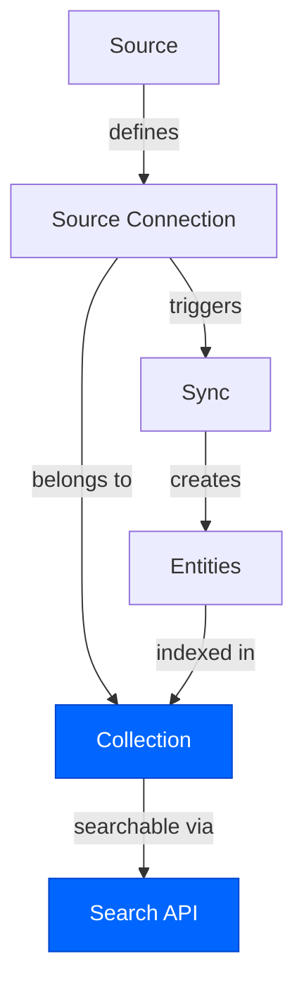
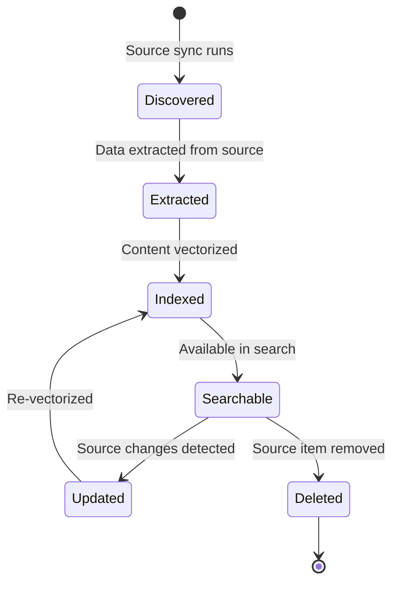

## Overview

Airweave is built around a few core concepts that work together to provide unified search across all your data sources. Understanding these concepts will help you make the most of Airweave.



## Sources

A **source** is a connector type that defines how Airweave connects to and extracts data from a specific platform or database. Sources are the building blocks of your data integration.

### What sources define

- **Authentication methods**: OAuth, API keys, database credentials
- **Configuration options**: Repository names, filters, sync preferences
- **Entity types**: What data structures the source can extract
- **Sync capabilities**: Full sync, incremental sync, continuous sync

### Available sources

Airweave supports 50+ sources across different categories:

<AccordionGroup>
  <Accordion title="Productivity & Communication">
    - **Notion**: Pages, databases, and wikis
    - **Slack**: Messages, threads, and files
    - **Gmail**: Emails, threads, and attachments
    - **Google Drive**: Documents, spreadsheets, and files
    - **Confluence**: Pages and spaces
    - **Microsoft Teams**: Messages and files
  </Accordion>

  <Accordion title="Development & Project Management">
    - **GitHub**: Repositories, issues, pull requests, and code
    - **GitLab**: Projects, issues, and merge requests
    - **Jira**: Issues, projects, and boards
    - **Linear**: Issues and projects
    - **Asana**: Tasks and projects
    - **ClickUp**: Tasks and docs
  </Accordion>

  <Accordion title="Business & CRM">
    - **Stripe**: Customers, payments, and invoices
    - **HubSpot**: Contacts, deals, and companies
    - **Salesforce**: Accounts, opportunities, and cases
    - **Zendesk**: Tickets and knowledge base
    - **Freshdesk**: Tickets and contacts
  </Accordion>

  <Accordion title="Databases & Storage">
    - **PostgreSQL**: Tables and records
    - **MySQL**: Tables and records
    - **MongoDB**: Collections and documents
    - **Dropbox**: Files and folders
    - **Box**: Files and folders
    - **OneDrive**: Files and folders
  </Accordion>
</AccordionGroup>

<Card
  title="View all connectors"
  icon="plug"
  href="/connectors/overview"
>
  See the complete list of supported sources and their capabilities
</Card>

### Source properties

Each source has specific properties that determine how it behaves:

| Property | Description | Example |
|----------|-------------|----------|
| `short_name` | Unique identifier for the source type | `github`, `stripe`, `notion` |
| `auth_methods` | Supported authentication methods | `["oauth_browser", "direct"]` |
| `output_entity_definitions` | Entity types this source produces | `["github_issue", "github_pr"]` |
| `supports_continuous` | Supports real-time syncing | `true` or `false` |
| `supports_temporal_relevance` | Entities have timestamps for recency ranking | `true` or `false` |
| `supports_access_control` | Document-level permissions | `true` or `false` |

## Source connections

A **source connection** is an authenticated instance of a source linked to a specific collection. It represents the actual connection between Airweave and your data.

### Key characteristics

- **One source, many connections**: You can create multiple connections to the same source type (e.g., multiple GitHub repos)
- **Collection-scoped**: Each connection belongs to exactly one collection
- **Authenticated**: Contains credentials or OAuth tokens for accessing the source
- **Configurable**: Source-specific settings like filters, branches, or table names

### Authentication methods

Source connections support different authentication methods:

<Tabs>
  <Tab title="Direct (API Key)">
    Provide credentials directly (API keys, passwords, connection strings):

    ```python
    source_connection = client.source_connections.create(
        name="Production Stripe",
        short_name="stripe",
        readable_collection_id="customer-data",
        authentication={
            "credentials": {
                "api_key": "sk_live_YOUR_KEY"
            }
        }
    )
    ```
  </Tab>

  <Tab title="OAuth Browser">
    Authenticate via browser OAuth flow:

    ```python
    source_connection = client.source_connections.create(
        name="Team Slack",
        short_name="slack",
        readable_collection_id="team-comms",
        redirect_url="https://app.example.com/connections"
    )
    # Visit source_connection.auth.auth_url to complete OAuth
    ```
  </Tab>

  <Tab title="OAuth Token">
    Provide a pre-obtained OAuth token:

    ```python
    source_connection = client.source_connections.create(
        name="Gmail Account",
        short_name="gmail",
        readable_collection_id="emails",
        authentication={
            "access_token": "ya29.a0...",
            "refresh_token": "1//0g...",
            "expires_at": "2024-12-31T23:59:59Z"
        }
    )
    ```
  </Tab>

  <Tab title="Auth Provider">
    Use an external authentication provider (Composio, Pipedream):

    ```python
    source_connection = client.source_connections.create(
        name="Gmail via Composio",
        short_name="gmail",
        readable_collection_id="emails",
        authentication={
            "provider_readable_id": "composio-xyz123"
        }
    )
    ```
  </Tab>
</Tabs>

### Connection lifecycle

Source connections go through different states:

| Status | Description |
|--------|-------------|
| `PENDING_AUTH` | Created but not yet authenticated |
| `ACTIVE` | Authenticated and syncing successfully |
| `SYNCING` | Currently running a sync job |
| `ERROR` | Last sync failed (check error details) |
| `INACTIVE` | Manually disabled by user |

## Collections

A **collection** is a searchable container that groups multiple source connections together. Collections are the primary search interface in Airweave.

### Why collections?

- **Unified search**: Query multiple sources with a single API call
- **Logical grouping**: Organize sources by use case, team, or project
- **Search isolation**: Each collection has its own search index
- **Access control**: Control who can search which collections

### Collection structure

```python
collection = client.collections.create(
    name="Engineering Knowledge Base"
)

# Properties:
# - id: UUID (550e8400-e29b-41d4-a716-446655440000)
# - readable_id: URL-safe identifier (engineering-knowledge-base-x7k9m)
# - name: Display name
# - vector_size: Embedding dimensions (3072)
# - embedding_model_name: Model used (text-embedding-3-large)
# - status: NEEDS_SOURCE, ACTIVE, or ERROR
# - created_at: ISO 8601 timestamp
# - modified_at: ISO 8601 timestamp
```

### Collection status

Collections have three possible states:

<AccordionGroup>
  <Accordion title="NEEDS_SOURCE">
    The collection has no authenticated connections, or connections exist but haven't synced yet. You can't search an empty collection.
  </Accordion>

  <Accordion title="ACTIVE">
    At least one source connection has completed a sync or is currently syncing. The collection is searchable.
  </Accordion>

  <Accordion title="ERROR">
    All source connections have failed their last sync. Check individual connection errors for details.
  </Accordion>
</AccordionGroup>

### Example: Multi-source collection

```python
# Create a collection for customer data
collection = client.collections.create(name="Customer Intelligence")

# Add multiple sources
client.source_connections.create(
    name="Stripe Payments",
    short_name="stripe",
    readable_collection_id=collection.readable_id,
    authentication={"credentials": {"api_key": "sk_live_..."}}
)

client.source_connections.create(
    name="Zendesk Support",
    short_name="zendesk",
    readable_collection_id=collection.readable_id,
    authentication={"credentials": {"api_key": "your_token"}}
)

client.source_connections.create(
    name="Slack Customer Channel",
    short_name="slack",
    readable_collection_id=collection.readable_id
    # OAuth flow for authentication
)

# Search across all three sources
results = client.collections.search(
    readable_id=collection.readable_id,
    query="customers complaining about billing issues"
)
```

## Entities

An **entity** is a single piece of data extracted from a source connection. Entities are the searchable units in Airweave.

### What are entities?

Entities represent different types of data depending on the source:

| Source | Entity Types | Examples |
|--------|--------------|----------|
| GitHub | Issues, Pull Requests, Files | `github_issue`, `github_pr`, `github_file` |
| Stripe | Customers, Payments, Invoices | `stripe_customer`, `stripe_payment` |
| Notion | Pages, Databases | `notion_page`, `notion_database` |
| Gmail | Threads, Messages | `gmail_thread`, `gmail_message` |
| Slack | Messages, Threads | `slack_message`, `slack_thread` |
| PostgreSQL | Table Rows | `postgres_row` |

### Entity structure

Every entity contains:

- **Content**: The actual data (markdown, JSON, text)
- **Metadata**: Source name, timestamps, status, custom fields
- **System fields**: Entity ID, collection ID, organization ID
- **Embeddings**: Vector representations for semantic search

### Entity lifecycle



### Accessing entity details

Search results include entity payloads:

```python
results = client.collections.search(
    readable_id="my-collection",
    query="recent bug reports"
)

for result in results.results:
    payload = result['payload']
    
    # Common fields across all entities
    print(f"Entity ID: {payload['entity_id']}")
    print(f"Source: {payload['source_name']}")
    print(f"Type: {payload['airweave_system_metadata']['entity_type']}")
    print(f"Content: {payload['md_content']}")
    print(f"Created: {payload.get('created_at')}")
    print(f"Score: {result['score']}")
```

## Syncs

A **sync** orchestrates the process of extracting data from a source connection and indexing it in a collection. Syncs run automatically on a schedule or can be triggered manually.

### Sync types

<Tabs>
  <Tab title="Full Sync">
    **Full sync** processes all data from the source, regardless of when it was last synced.

    - **When to use**: Initial sync, data refresh, schema changes
    - **Schedule**: Hourly, daily, weekly (cron expressions)
    - **Performance**: Slower but ensures completeness

    ```python
    # Configure full sync schedule
    source_connection = client.source_connections.create(
        name="GitHub Repo",
        short_name="github",
        readable_collection_id=collection_id,
        config={"repo_name": "company/repo"},
        schedule={
            "cron": "0 */6 * * *"  # Every 6 hours
        }
    )
    ```
  </Tab>

  <Tab title="Incremental Sync">
    **Incremental sync** only processes changes since the last sync using a cursor.

    - **When to use**: Continuous updates, large datasets
    - **Schedule**: Minutes to hours (cron expressions)
    - **Performance**: Fast, efficient, near real-time

    ```python
    # Configure incremental sync
    source_connection = client.source_connections.create(
        name="Stripe Account",
        short_name="stripe",
        readable_collection_id=collection_id,
        schedule={
            "continuous": True,
            "cursor_field": "created_at",
            "cron": "*/5 * * * *"  # Every 5 minutes
        }
    )
    ```
  </Tab>

  <Tab title="Manual Sync">
    **Manual sync** runs on demand via API or dashboard.

    - **When to use**: Testing, one-time imports
    - **Schedule**: None (triggered manually)
    - **Performance**: Runs immediately

    ```python
    # Trigger manual sync
    sync_job = client.source_connections.sync(
        source_connection_id=source_connection.id
    )
    
    print(f"Sync job ID: {sync_job.id}")
    print(f"Status: {sync_job.status}")
    ```
  </Tab>
</Tabs>

### Sync jobs

Each sync execution creates a **sync job** that tracks:

- **Status**: `PENDING`, `RUNNING`, `COMPLETED`, `FAILED`, `CANCELLED`
- **Timing**: Start time, end time, duration
- **Entity counts**: Inserted, updated, deleted, failed
- **Errors**: Error messages and details if failed

```python
# Get sync job details
jobs = client.source_connections.get_jobs(
    source_connection_id=source_connection.id,
    limit=10
)

for job in jobs:
    print(f"Job {job.id}:")
    print(f"  Status: {job.status}")
    print(f"  Duration: {job.duration_seconds}s")
    print(f"  Inserted: {job.entities_inserted}")
    print(f"  Updated: {job.entities_updated}")
    print(f"  Failed: {job.entities_failed}")
    if job.error:
        print(f"  Error: {job.error}")
```

### Monitoring syncs

You can monitor sync progress through:

1. **Dashboard**: Visual sync history and status
2. **API**: Query sync jobs programmatically
3. **Webhooks**: Receive notifications on sync events (coming soon)

## Putting it all together

Here's how all the concepts work together in a real-world example:

<Steps>
  <Step title="Register sources">
    Airweave comes with 50+ pre-built sources (GitHub, Stripe, Notion, etc.). Sources define how to connect and extract data.
  </Step>

  <Step title="Create a collection">
    You create a collection called "Customer Intelligence" to search all customer-related data.
  </Step>

  <Step title="Add source connections">
    You add three source connections to the collection:
    - Stripe (for payment data)
    - Zendesk (for support tickets)
    - Slack (for customer conversations)
    
    Each connection authenticates with its respective service.
  </Step>

  <Step title="Syncs run automatically">
    Airweave automatically syncs data from all three sources on the configured schedule. Each sync creates entities:
    - Stripe: Customer, Payment, Invoice entities
    - Zendesk: Ticket, Comment entities
    - Slack: Message, Thread entities
  </Step>

  <Step title="Entities are indexed">
    All entities are vectorized and indexed in the collection's search index. You now have a unified view of all customer data.
  </Step>

  <Step title="Search across everything">
    You query the collection with "customers with failed payments and open tickets". Airweave searches across all sources and returns relevant entities from Stripe, Zendesk, and Slack.
  </Step>
</Steps>

## Next steps

<CardGroup cols={2}>
  <Card
    title="Add connectors"
    icon="plug"
    href="/connectors/overview"
  >
    Explore the 50+ available sources and add them to your collections
  </Card>
  <Card
    title="Master search"
    icon="magnifying-glass"
    href="/search"
  >
    Learn about filters, reranking, query expansion, and advanced search features
  </Card>
  <Card
    title="API reference"
    icon="code"
    href="/api-reference"
  >
    Explore the complete REST API documentation
  </Card>
  <Card
    title="Build agents"
    icon="robot"
    href="/integrations/mcp"
  >
    Integrate Airweave with AI agents and RAG systems
  </Card>
</CardGroup>
