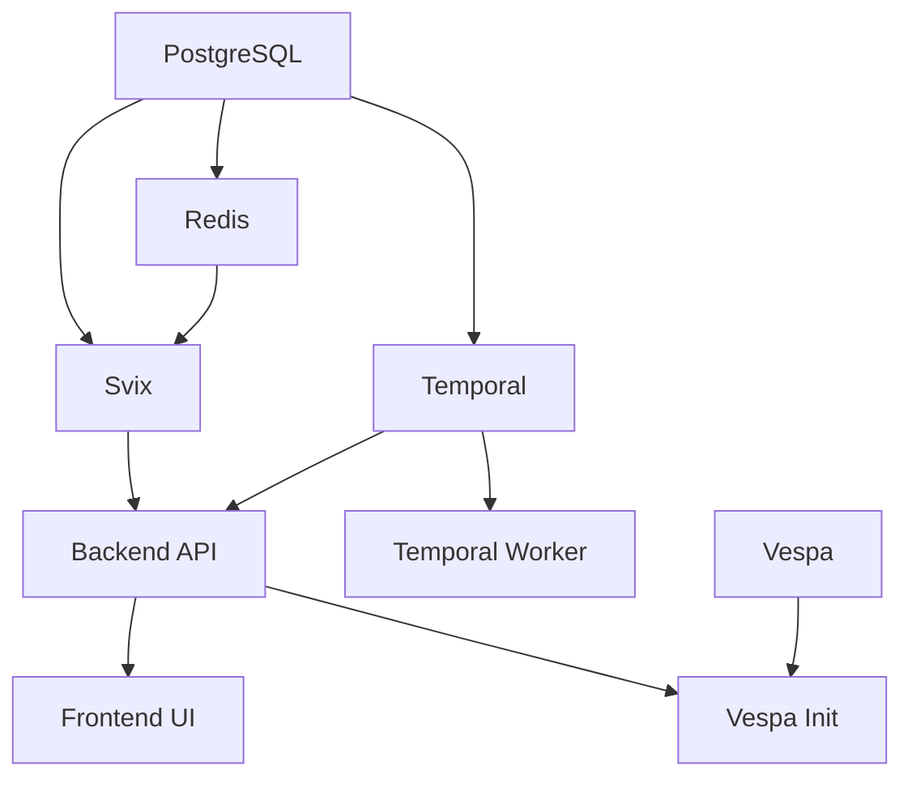

## Deployment Options

Airweave can be deployed in several ways depending on your infrastructure and scalability requirements:

<CardGroup cols={2}>

<Card title="Docker Compose" icon="docker" href="/deployment/docker-compose">
  Single-server deployment for development and small production workloads
</Card>

<Card title="Kubernetes" icon="dharmachakra" href="/deployment/kubernetes">
  Scalable production deployment with orchestration and high availability
</Card>

<Card title="Airweave Cloud" icon="cloud" href="https://app.airweave.ai">
  Fully managed hosting - no infrastructure required
</Card>

<Card title="Configuration" icon="gear" href="/deployment/configuration">
  Environment variables and advanced configuration options
</Card>

</CardGroup>

## Architecture Components

Airweave consists of several interconnected services:

### Core Services

<AccordionGroup>
  <Accordion title="Backend API" icon="server">
    **Technology**: FastAPI (Python 3.11)
    
    The main application server that handles:
    - REST API endpoints
    - Authentication and authorization
    - Business logic and orchestration
    - Database migrations (Alembic)
    
    **Ports**: 
    - `8001` - API server
    - `9090` - Metrics/monitoring
    
    **Health check**: `http://localhost:8001/health/ready`
  </Accordion>

  <Accordion title="Frontend UI" icon="browser">
    **Technology**: React/TypeScript with Vite
    
    Web-based user interface for:
    - Managing collections and source connections
    - Configuring integrations
    - Monitoring sync jobs
    - Testing search queries
    
    **Port**: `8080` (default)
    
    **Build**: Multi-stage Docker build with production optimization
  </Accordion>

  <Accordion title="PostgreSQL" icon="database">
    **Version**: 16
    
    Primary data store for:
    - User accounts and permissions
    - Collection and source metadata
    - Sync job history and state
    - Webhook subscriptions
    
    **Port**: `5432`
    
    **Optimized settings**:
    - `max_connections=200`
    - `shared_buffers=256MB`
    - `effective_cache_size=1GB`
  </Accordion>

  <Accordion title="Redis" icon="database">
    **Version**: 7-alpine
    
    Used for:
    - Pub/sub messaging
    - Session storage
    - Webhook queue management (via Svix)
    
    **Port**: `6379`
  </Accordion>
</AccordionGroup>

### Search & Indexing

<AccordionGroup>
  <Accordion title="Vespa" icon="magnifying-glass">
    **Version**: 8
    
    Vector search engine for:
    - Dense vector embeddings (configurable dimensions)
    - Sparse BM25 embeddings
    - Hybrid search ranking
    - Real-time document indexing
    
    **Ports**:
    - `8081` - Query/Document API
    - `19071` - Config server
    
    **Features**:
    - Dynamic schema templating based on embedding dimensions
    - Automatic deployment via init container
    - Persistent storage with Docker volumes
  </Accordion>

  <Accordion title="Embeddings Service (Optional)" icon="microchip">
    **Image**: `semitechnologies/transformers-inference`
    
    Local embedding generation using:
    - Model: `sentence-transformers-all-MiniLM-L6-v2`
    - Dimensions: 384
    
    **Port**: `9878`
    
    **Note**: Automatically skipped if `OPENAI_API_KEY` is provided. Uses ~2GB of memory.
  </Accordion>
</AccordionGroup>

### Workflow Orchestration

<AccordionGroup>
  <Accordion title="Temporal" icon="clock">
    **Version**: 1.24.2
    
    Durable workflow engine for:
    - Data sync orchestration
    - Retry logic and error handling
    - Long-running background tasks
    - Scheduled sync jobs
    
    **Ports**:
    - `7233` - gRPC API
    - `8233` - Internal metrics
  </Accordion>

  <Accordion title="Temporal UI" icon="chart-line">
    **Version**: 2.26.2
    
    Web interface for:
    - Workflow monitoring
    - Task queue inspection
    - Debugging failed workflows
    
    **Port**: `8088`
  </Accordion>

  <Accordion title="Temporal Worker" icon="gears">
    Executes workflow tasks including:
    - Connector sync activities
    - Document processing
    - Embedding generation
    - Cleanup tasks
    
    Uses the same backend image as the API server.
  </Accordion>
</AccordionGroup>

### Additional Services

<Accordion title="Svix" icon="webhook">
  **Webhook delivery system**
  
  Manages:
  - Webhook subscriptions
  - Event delivery with retries
  - Delivery logs and debugging
  
  **Port**: `8071`
  
  **Features**:
  - Redis-based queue
  - Subnet whitelisting for testing
  - Automatic database initialization
</Accordion>

## Resource Requirements

### Minimum (Development)

- **CPU**: 2 cores
- **Memory**: 4GB RAM
- **Storage**: 10GB
- **Docker**: 20.10+ with Docker Compose

### Recommended (Production)

- **CPU**: 4-8 cores
- **Memory**: 8-16GB RAM
- **Storage**: 50GB+ (depends on data volume)
- **Network**: Stable internet for connector syncs

<Warning>
  The local embeddings service requires ~2GB of memory. If you have limited resources, use OpenAI or Mistral embeddings instead.
</Warning>

## Service Dependencies

The startup sequence is managed automatically via health checks:

## Storage Options

Airweave supports multiple storage backends for file attachments:

| Backend | Use Case | Configuration |
|---------|----------|---------------|
| **Filesystem** | Local development, K8s PVC | `STORAGE_BACKEND=filesystem` |
| **Azure Blob** | Azure-based deployments | `STORAGE_BACKEND=azure` |
| **AWS S3** | AWS deployments or S3-compatible | `STORAGE_BACKEND=aws` |
| **GCP Storage** | Google Cloud deployments | `STORAGE_BACKEND=gcp` |

<Note>
  By default, local deployments use filesystem storage at `./local_storage`. See [Configuration](/deployment/configuration) for cloud storage setup.
</Note>

## Next Steps

<Steps>
  <Step title="Choose your deployment method">
    - [Docker Compose](/deployment/docker-compose) for quick setup
    - [Kubernetes](/deployment/kubernetes) for production scale
  </Step>
  
  <Step title="Configure environment variables">
    Review [Configuration](/deployment/configuration) for all available options
  </Step>
  
  <Step title="Set up integrations">
    Configure connector credentials and embedding providers
  </Step>
  
  <Step title="Monitor your deployment">
    Use Temporal UI and backend health endpoints to verify services
  </Step>
</Steps>