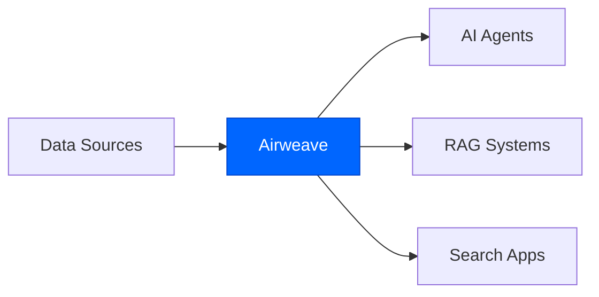

## What is Airweave?

Airweave is an open-source platform that connects to your apps, tools, and databases, continuously syncs their data, and exposes it through a unified, LLM-friendly search interface. AI agents query Airweave to retrieve relevant, grounded, up-to-date context from multiple sources in a single request.

<CardGroup cols={2}>
  <Card
    title="Connect your data sources"
    icon="plug"
    href="/connectors/overview"
  >
    50+ integrations including GitHub, Notion, Slack, Stripe, Gmail, and databases
  </Card>
  <Card
    title="Search with natural language"
    icon="magnifying-glass"
    href="/search"
  >
    AI-powered semantic search with filters, reranking, and query expansion
  </Card>
  <Card
    title="Build AI agents"
    icon="robot"
    href="/mcp-server"
  >
    Native integrations with agent frameworks via SDKs, REST API, and MCP
  </Card>
  <Card
    title="Deploy anywhere"
    icon="cloud"
    href="/deployment/docker-compose"
  >
    Cloud-hosted at app.airweave.ai or self-hosted with Docker
  </Card>
</CardGroup>

## Where it fits

Airweave sits between your data sources and AI systems as shared retrieval infrastructure. It handles authentication, ingestion, syncing, indexing, and retrieval so you don't have to rebuild fragile pipelines for every agent or integration.



## How it works

<Steps>
  <Step title="Connect your data sources">
    Authenticate with your apps and databases using OAuth, API keys, or database credentials. Airweave supports 50+ integrations including:
    
    - **Productivity**: Notion, Slack, Gmail, Google Drive, Confluence
    - **Development**: GitHub, GitLab, Bitbucket, Jira, Linear
    - **Business**: Stripe, HubSpot, Salesforce, Zendesk
    - **Databases**: PostgreSQL, MySQL, MongoDB
  </Step>
  
  <Step title="Data syncs automatically">
    Airweave continuously syncs data from your sources, extracts entities (documents, issues, emails, customers), and indexes them for semantic search. Configure sync schedules or enable real-time continuous syncing.
  </Step>
  
  <Step title="Search with natural language">
    Query your collections using the Python SDK, TypeScript SDK, or REST API. Results are ranked by relevance, filtered by source and metadata, and optionally reranked with AI for improved accuracy.
  </Step>
  
  <Step title="Retrieve grounded context">
    Get relevant, up-to-date information from all your connected sources in a single request. Perfect for RAG systems, AI agents, and semantic search applications.
  </Step>
</Steps>

## Example: Search across all your data

<CodeGroup>

```python Python
from airweave import AirweaveSDK

client = AirweaveSDK(api_key="YOUR_API_KEY")

# Search across GitHub, Notion, and Slack
results = client.collections.search(
    readable_id="engineering-docs",
    query="How do we handle authentication in the API?"
)

for result in results.results:
    print(f"Source: {result['payload']['source_name']}")
    print(f"Content: {result['payload']['md_content'][:200]}")
    print(f"Score: {result['score']}\n")
```

```typescript TypeScript
import { AirweaveClient } from '@airweave/sdk';

const client = new AirweaveClient({ apiKey: 'YOUR_API_KEY' });

// Search across GitHub, Notion, and Slack
const results = await client.collections.search({
  readableId: 'engineering-docs',
  query: 'How do we handle authentication in the API?'
});

for (const result of results.results) {
  console.log(`Source: ${result.payload.source_name}`);
  console.log(`Content: ${result.payload.md_content.slice(0, 200)}`);
  console.log(`Score: ${result.score}\n`);
}
```

```bash cURL
curl -X POST https://api.airweave.ai/v1/collections/engineering-docs/search \
  -H "Authorization: Bearer YOUR_API_KEY" \
  -H "Content-Type: application/json" \
  -d '{
    "query": "How do we handle authentication in the API?"
  }'
```

</CodeGroup>

## Key features

<AccordionGroup>
  <Accordion title="Unified search across all sources">
    Create collections that group multiple data sources together. Search across GitHub, Notion, Slack, databases, and more with a single query. No need to query each source separately or manage multiple APIs.
  </Accordion>

  <Accordion title="AI-powered semantic search">
    Airweave uses advanced embedding models to understand the meaning of your queries, not just keyword matching. Supports hybrid search (semantic + keyword), query expansion, and AI reranking for maximum accuracy.
  </Accordion>

  <Accordion title="Automatic sync and indexing">
    Set up a source connection once and Airweave handles the rest. Data syncs automatically on a schedule or continuously. Incremental syncing ensures you only process changes, not entire datasets.
  </Accordion>

  <Accordion title="Flexible filtering and ranking">
    Filter results by source, date range, status, or custom metadata. Apply recency bias to prefer newer content. Set score thresholds for high-confidence results only.
  </Accordion>

  <Accordion title="Production-ready infrastructure">
    Built on PostgreSQL, Vespa, Temporal, and Redis. Scales to millions of documents. Self-host with Docker or use the managed cloud service. SOC 2 Type II compliant.
  </Accordion>

  <Accordion title="Native agent integrations">
    Works with popular AI frameworks out of the box. Model Context Protocol (MCP) server included. Python and TypeScript SDKs with full type safety. REST API for any language.
  </Accordion>
</AccordionGroup>

## Get started in minutes

<CardGroup cols={2}>
  <Card
    title="Cloud (Recommended)"
    icon="cloud"
    href="https://app.airweave.ai"
  >
    Hosted service with free tier. No setup required.
  </Card>
  <Card
    title="Self-hosted"
    icon="server"
    href="/deployment/docker-compose"
  >
    Run locally with Docker in under 5 minutes.
  </Card>
</CardGroup>

<Card
  title="Follow the quickstart"
  icon="rocket"
  href="/quickstart"
>
  Create your first collection and search in under 10 minutes
</Card>

## Community and support

<CardGroup cols={3}>
  <Card
    title="Discord"
    icon="discord"
    href="https://discord.gg/gDuebsWGkn"
  >
    Join our community for help and discussions
  </Card>
  <Card
    title="GitHub"
    icon="github"
    href="https://github.com/airweave-ai/airweave"
  >
    Star the repo and contribute
  </Card>
  <Card
    title="Twitter"
    icon="twitter"
    href="https://x.com/airweave_ai"
  >
    Follow for updates and announcements
  </Card>
</CardGroup>
