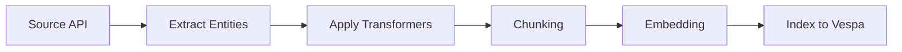

## Overview

Transformers are custom data processing functions that transform entities from one schema to another before indexing. They enable:

- **Data enrichment**: Add computed fields or metadata
- **Schema mapping**: Convert between entity definitions
- **Filtering**: Remove sensitive or irrelevant data
- **Aggregation**: Combine multiple entities into summaries

<Info>
  Transformers run **after** data extraction but **before** chunking and embedding.
</Info>

## Transformer Model

Each transformer is defined in the database with:

<ParamField path="name" type="string" required>
  Human-readable transformer name
  
  **Example**: `"Enrich Support Tickets"`
</ParamField>

<ParamField path="description" type="string">
  Optional description of what the transformer does
  
  **Example**: `"Adds customer sentiment and priority scores to support tickets"`
</ParamField>

<ParamField path="method_name" type="string" required>
  Python function name to invoke
  
  **Example**: `"enrich_support_ticket"`
</ParamField>

<ParamField path="module_name" type="string" required>
  Python module path where the function is defined
  
  **Example**: `"airweave.platform.transformers.support"`
</ParamField>

<ParamField path="input_entity_definition_ids" type="list[UUID]" required>
  List of entity definition IDs this transformer accepts as input
  
  **Example**: `["abc-123-def"]` (Support Ticket entity)
</ParamField>

<ParamField path="output_entity_definition_ids" type="list[UUID]" required>
  List of entity definition IDs this transformer produces as output
  
  **Example**: `["xyz-789-ghi"]` (Enriched Support Ticket entity)
</ParamField>

<ParamField path="config_schema" type="JSONSchema" required>
  JSON Schema defining configuration parameters for the transformer
  
  **Example**:
  ```json
  {
    "type": "object",
    "properties": {
      "sentiment_threshold": {
        "type": "number",
        "minimum": 0,
        "maximum": 1,
        "default": 0.5
      },
      "priority_weights": {
        "type": "object",
        "properties": {
          "urgency": {"type": "number"},
          "impact": {"type": "number"}
        }
      }
    }
  }
  ```
</ParamField>

<ParamField path="organization_id" type="UUID">
  Organization that owns this transformer (null for system transformers)
</ParamField>

## Database Schema

```sql
CREATE TABLE transformer (
    id UUID PRIMARY KEY DEFAULT gen_random_uuid(),
    name VARCHAR NOT NULL,
    description VARCHAR,
    method_name VARCHAR NOT NULL,
    module_name VARCHAR NOT NULL,
    input_entity_definition_ids JSON NOT NULL,   -- Array of UUIDs
    output_entity_definition_ids JSON NOT NULL,  -- Array of UUIDs
    config_schema JSON NOT NULL,                 -- JSON Schema
    organization_id UUID REFERENCES organization(id),
    created_at TIMESTAMP DEFAULT NOW(),
    modified_at TIMESTAMP DEFAULT NOW(),
    created_by_email VARCHAR,
    modified_by_email VARCHAR
);
```

## API Endpoints

Manage transformers via REST API:

### List Transformers

```http
GET /api/v1/transformers
```

**Response**:
```json
[
  {
    "id": "abc-123-def-456",
    "name": "Enrich Support Tickets",
    "description": "Adds sentiment and priority scores",
    "method_name": "enrich_support_ticket",
    "module_name": "airweave.platform.transformers.support",
    "input_entity_definition_ids": ["entity-def-1"],
    "output_entity_definition_ids": ["entity-def-2"],
    "config_schema": {...},
    "organization_id": "org-123",
    "created_by_email": "admin@example.com",
    "modified_by_email": "admin@example.com"
  }
]
```

### Create Transformer

```http
POST /api/v1/transformers
Content-Type: application/json

{
  "name": "Code Comment Extractor",
  "description": "Extracts docstrings and inline comments from code",
  "method_name": "extract_code_comments",
  "module_name": "airweave.platform.transformers.code",
  "input_entity_definition_ids": ["code-file-entity-id"],
  "output_entity_definition_ids": ["comment-entity-id"],
  "config_schema": {
    "type": "object",
    "properties": {
      "include_inline": {"type": "boolean", "default": true},
      "min_length": {"type": "integer", "default": 10}
    }
  }
}
```

**Response**: `201 Created` with transformer object

### Update Transformer

```http
PUT /api/v1/transformers/{transformer_id}
Content-Type: application/json

{
  "name": "Updated Transformer Name",
  "description": "Updated description",
  ...
}
```

**Response**: `200 OK` with updated transformer object

## Implementation Example

Create a transformer function:

<CodeGroup>

```python Basic Transformer
# File: backend/airweave/platform/transformers/support.py

from typing import Any, Dict, List

async def enrich_support_ticket(
    entities: List[Dict[str, Any]],
    config: Dict[str, Any]
) -> List[Dict[str, Any]]:
    """Enrich support tickets with sentiment and priority.
    
    Args:
        entities: List of support ticket entities from input definition
        config: Configuration from transformer config_schema
    
    Returns:
        List of enriched entities matching output definition
    """
    enriched = []
    
    for ticket in entities:
        # Extract configuration
        sentiment_threshold = config.get("sentiment_threshold", 0.5)
        priority_weights = config.get("priority_weights", {
            "urgency": 0.6,
            "impact": 0.4
        })
        
        # Analyze sentiment (simplified example)
        text = ticket.get("description", "")
        sentiment_score = await analyze_sentiment(text)
        
        # Calculate priority
        urgency = ticket.get("urgency", 0)
        impact = ticket.get("impact", 0)
        priority = (
            urgency * priority_weights["urgency"] + 
            impact * priority_weights["impact"]
        )
        
        # Create enriched entity
        enriched_ticket = {
            **ticket,  # Original fields
            "sentiment_score": sentiment_score,
            "sentiment_label": "positive" if sentiment_score > sentiment_threshold else "negative",
            "calculated_priority": priority,
            "priority_label": "high" if priority > 0.7 else "medium" if priority > 0.4 else "low"
        }
        
        enriched.append(enriched_ticket)
    
    return enriched
```

```python Entity Mapping Transformer
# File: backend/airweave/platform/transformers/mapping.py

from typing import Any, Dict, List

async def map_salesforce_to_crm(
    entities: List[Dict[str, Any]],
    config: Dict[str, Any]
) -> List[Dict[str, Any]]:
    """Map Salesforce account schema to internal CRM schema.
    
    Args:
        entities: Salesforce Account entities
        config: Field mapping configuration
    
    Returns:
        Internal CRM Account entities
    """
    mapped = []
    
    # Get field mappings from config
    field_map = config.get("field_mappings", {
        "Name": "company_name",
        "BillingAddress": "primary_address",
        "Phone": "phone_number",
        "Industry": "industry_sector"
    })
    
    for sf_account in entities:
        crm_account = {}
        
        # Map fields according to config
        for sf_field, crm_field in field_map.items():
            if sf_field in sf_account:
                crm_account[crm_field] = sf_account[sf_field]
        
        # Add computed fields
        crm_account["source"] = "salesforce"
        crm_account["source_id"] = sf_account.get("Id")
        crm_account["last_synced"] = datetime.utcnow().isoformat()
        
        mapped.append(crm_account)
    
    return mapped
```

```python Filtering Transformer
# File: backend/airweave/platform/transformers/filters.py

from typing import Any, Dict, List
import re

async def filter_sensitive_data(
    entities: List[Dict[str, Any]],
    config: Dict[str, Any]
) -> List[Dict[str, Any]]:
    """Remove or redact sensitive information from entities.
    
    Args:
        entities: Input entities
        config: Redaction rules configuration
    
    Returns:
        Filtered entities with sensitive data removed
    """
    filtered = []
    
    # Get redaction patterns from config
    pii_patterns = config.get("pii_patterns", {
        "ssn": r"\b\d{3}-\d{2}-\d{4}\b",
        "credit_card": r"\b\d{4}[\s-]?\d{4}[\s-]?\d{4}[\s-]?\d{4}\b",
        "email": r"\b[A-Za-z0-9._%+-]+@[A-Za-z0-9.-]+\.[A-Z|a-z]{2,}\b"
    })
    
    redact_fields = config.get("redact_fields", [])
    
    for entity in entities:
        filtered_entity = entity.copy()
        
        # Remove entire fields if listed
        for field in redact_fields:
            filtered_entity.pop(field, None)
        
        # Redact patterns in text fields
        for field, value in filtered_entity.items():
            if isinstance(value, str):
                for pattern_name, pattern in pii_patterns.items():
                    value = re.sub(pattern, f"[REDACTED_{pattern_name.upper()}]", value)
                filtered_entity[field] = value
        
        filtered.append(filtered_entity)
    
    return filtered
```

```python Aggregation Transformer
# File: backend/airweave/platform/transformers/aggregation.py

from typing import Any, Dict, List
from collections import defaultdict

async def aggregate_messages_by_thread(
    entities: List[Dict[str, Any]],
    config: Dict[str, Any]
) -> List[Dict[str, Any]]:
    """Aggregate individual messages into conversation threads.
    
    Args:
        entities: Individual message entities
        config: Aggregation configuration
    
    Returns:
        Thread entities with aggregated messages
    """
    # Group messages by thread_id
    threads = defaultdict(list)
    
    for message in entities:
        thread_id = message.get("thread_id") or message.get("id")
        threads[thread_id].append(message)
    
    # Create thread entities
    thread_entities = []
    
    for thread_id, messages in threads.items():
        # Sort messages by timestamp
        messages.sort(key=lambda m: m.get("created_at", ""))
        
        # Build aggregated thread
        thread = {
            "id": thread_id,
            "message_count": len(messages),
            "participants": list(set(
                m.get("sender") for m in messages if m.get("sender")
            )),
            "first_message_at": messages[0].get("created_at"),
            "last_message_at": messages[-1].get("created_at"),
            "full_conversation": "\n\n".join(
                f"{m.get('sender', 'Unknown')}: {m.get('body', '')}"
                for m in messages
            ),
            "subject": messages[0].get("subject"),
            "labels": list(set(
                label 
                for m in messages 
                for label in m.get("labels", [])
            ))
        }
        
        thread_entities.append(thread)
    
    return thread_entities
```

</CodeGroup>

## Transformer Function Signature

All transformer functions must follow this signature:

```python
async def transformer_name(
    entities: List[Dict[str, Any]],
    config: Dict[str, Any]
) -> List[Dict[str, Any]]:
    """Transformer docstring.
    
    Args:
        entities: Input entities matching input_entity_definition_ids
        config: Configuration validated against config_schema
    
    Returns:
        Output entities matching output_entity_definition_ids
    """
    pass
```

**Requirements**:
- Must be `async`
- Takes exactly 2 parameters: `entities` and `config`
- Returns list of dictionaries (entities)
- Can be in any module (specify via `module_name`)

## Configuration Schema

Define transformer parameters using JSON Schema:

<CodeGroup>

```json Simple Config
{
  "type": "object",
  "properties": {
    "enabled": {
      "type": "boolean",
      "default": true,
      "description": "Enable/disable this transformer"
    },
    "threshold": {
      "type": "number",
      "minimum": 0,
      "maximum": 1,
      "default": 0.5
    }
  },
  "required": ["threshold"]
}
```

```json Complex Config
{
  "type": "object",
  "properties": {
    "field_mappings": {
      "type": "object",
      "description": "Source to target field mappings",
      "additionalProperties": {"type": "string"}
    },
    "filters": {
      "type": "array",
      "items": {
        "type": "object",
        "properties": {
          "field": {"type": "string"},
          "operator": {
            "type": "string",
            "enum": ["equals", "contains", "regex"]
          },
          "value": {"type": "string"}
        },
        "required": ["field", "operator", "value"]
      }
    },
    "enrichment": {
      "type": "object",
      "properties": {
        "enable_sentiment": {"type": "boolean", "default": true},
        "enable_categorization": {"type": "boolean", "default": false},
        "categories": {
          "type": "array",
          "items": {"type": "string"}
        }
      }
    }
  },
  "required": ["field_mappings"]
}
```

</CodeGroup>

## Execution Pipeline

Transformers are executed during the sync pipeline:



<Steps>
  <Step title="Entity Extraction">
    Source connector extracts raw entities from API
  </Step>

  <Step title="Transformer Lookup">
    System looks up transformers configured for this entity definition
  </Step>

  <Step title="Execution">
    Transformers execute in configured order:
    ```python
    for transformer in transformers:
        entities = await invoke_transformer(
            transformer.module_name,
            transformer.method_name,
            entities,
            transformer_config
        )
    ```
  </Step>

  <Step title="Schema Validation">
    Output entities validated against output entity definition schema
  </Step>

  <Step title="Continue Pipeline">
    Transformed entities proceed to chunking → embedding → indexing
  </Step>
</Steps>

## Best Practices

<AccordionGroup>
  <Accordion title="Keep transformers focused" icon="target">
    Each transformer should do **one thing well**:
    
    ✅ **Good**:
    - `extract_code_comments` - Single purpose
    - `calculate_priority` - Specific calculation
    - `redact_pii` - Clear responsibility
    
    ❌ **Avoid**:
    - `process_everything` - Too broad
    - `enrich_and_filter_and_map` - Multiple concerns
  </Accordion>

  <Accordion title="Use config for flexibility" icon="sliders">
    Make transformers configurable via `config_schema`:
    
    ```python
    # Instead of hardcoding
    if sentiment_score > 0.5:  # ❌ Hardcoded
        ...
    
    # Use config
    threshold = config.get("sentiment_threshold", 0.5)  # ✅ Configurable
    if sentiment_score > threshold:
        ...
    ```
  </Accordion>

  <Accordion title="Handle errors gracefully" icon="shield">
    Don't let single entity failures break entire batch:
    
    ```python
    results = []
    
    for entity in entities:
        try:
            transformed = await transform_entity(entity, config)
            results.append(transformed)
        except Exception as e:
            logger.error(f"Failed to transform entity {entity.get('id')}: {e}")
            # Option 1: Skip entity
            continue
            # Option 2: Return original entity
            # results.append(entity)
    
    return results
    ```
  </Accordion>

  <Accordion title="Document input/output schemas" icon="file-lines">
    Clearly document expected entity structure:
    
    ```python
    async def my_transformer(
        entities: List[Dict[str, Any]],
        config: Dict[str, Any]
    ) -> List[Dict[str, Any]]:
        """Transform support tickets.
        
        Input schema (from Zendesk):
        {
            "id": "123",
            "subject": "...",
            "description": "...",
            "priority": "high"|"medium"|"low",
            "status": "open"|"closed"
        }
        
        Output schema (enriched):
        {
            ... (all input fields) ...
            "sentiment_score": 0.0-1.0,
            "urgency_level": 1-5,
            "estimated_resolution_time": "2h"|"1d"|"1w"
        }
        
        Config schema:
        {
            "sentiment_model": "basic"|"advanced",
            "urgency_weights": {"priority": 0.6, "age": 0.4}
        }
        """
    ```
  </Accordion>

  <Accordion title="Optimize for batch processing" icon="gauge-high">
    Process entities in batches when possible:
    
    ```python
    # ❌ Inefficient: One API call per entity
    for entity in entities:
        sentiment = await api.analyze(entity["text"])
    
    # ✅ Efficient: Batch API call
    texts = [e["text"] for e in entities]
    sentiments = await api.analyze_batch(texts)
    
    for entity, sentiment in zip(entities, sentiments):
        entity["sentiment"] = sentiment
    ```
  </Accordion>
</AccordionGroup>

## Use Cases

<Tabs>
  <Tab title="Data Enrichment">
    Add computed or external data:
    
    **Examples**:
    - Sentiment analysis on customer feedback
    - Geocoding addresses to lat/lng
    - Fetching stock prices for company mentions
    - Calculating metrics from raw data
    - Adding taxonomy/category labels
  </Tab>

  <Tab title="Schema Normalization">
    Map different source schemas to unified format:
    
    **Examples**:
    - Salesforce → Internal CRM schema
    - GitHub Issues → Jira tickets
    - Gmail → Unified email format
    - Multiple HR systems → Single employee schema
  </Tab>

  <Tab title="Data Cleaning">
    Remove or fix data quality issues:
    
    **Examples**:
    - Redacting PII (SSN, credit cards)
    - Normalizing phone numbers
    - Fixing malformed dates
    - Removing duplicate fields
    - Stripping HTML/markdown
  </Tab>

  <Tab title="Aggregation">
    Combine multiple entities:
    
    **Examples**:
    - Email threads from individual messages
    - Conversation summaries from chat messages
    - Project timelines from task updates
    - Customer journey from touchpoints
  </Tab>
</Tabs>

## Troubleshooting

<AccordionGroup>
  <Accordion title="Transformer not executing">
    **Check**:
    1. Transformer registered in database
    2. `input_entity_definition_ids` matches source entities
    3. `module_name` and `method_name` are correct
    4. Function signature matches protocol
    
    **Debug**:
    ```python
    # Add logging to transformer
    logger.info(f"Transformer {transformer.name} executing on {len(entities)} entities")
    ```
  </Accordion>

  <Accordion title="Import errors">
    **Symptom**:
    ```
    ModuleNotFoundError: No module named 'airweave.platform.transformers.custom'
    ```
    
    **Solution**: Ensure module exists at specified path:
    ```bash
    backend/airweave/platform/transformers/custom.py
    ```
  </Accordion>

  <Accordion title="Config validation failures">
    **Symptom**: Transformer fails with config errors
    
    **Solution**: Validate config against schema before saving:
    ```python
    from jsonschema import validate, ValidationError
    
    try:
        validate(instance=config, schema=transformer.config_schema)
    except ValidationError as e:
        print(f"Config invalid: {e.message}")
    ```
  </Accordion>

  <Accordion title="Output entities rejected">
    **Symptom**: Transformed entities fail validation
    
    **Solution**: Ensure output matches `output_entity_definition_ids` schema:
    ```python
    # Check required fields are present
    required_fields = ["id", "title", "content"]
    for entity in output_entities:
        for field in required_fields:
            if field not in entity:
                raise ValueError(f"Missing required field: {field}")
    ```
  </Accordion>
</AccordionGroup>

## Next Steps

<CardGroup cols={2}>

<Card title="Entity Definitions" icon="table" href="/api-reference/entities/list">
  Define input and output schemas
</Card>

<Card title="Chunking" icon="scissors" href="/chunking">
  Configure chunking after transformation
</Card>

<Card title="Embeddings" icon="brain" href="/embeddings">
  Set up embeddings for transformed entities
</Card>

<Card title="API Reference" icon="code" href="/api-reference/transformers">
  Complete API documentation
</Card>

</CardGroup>